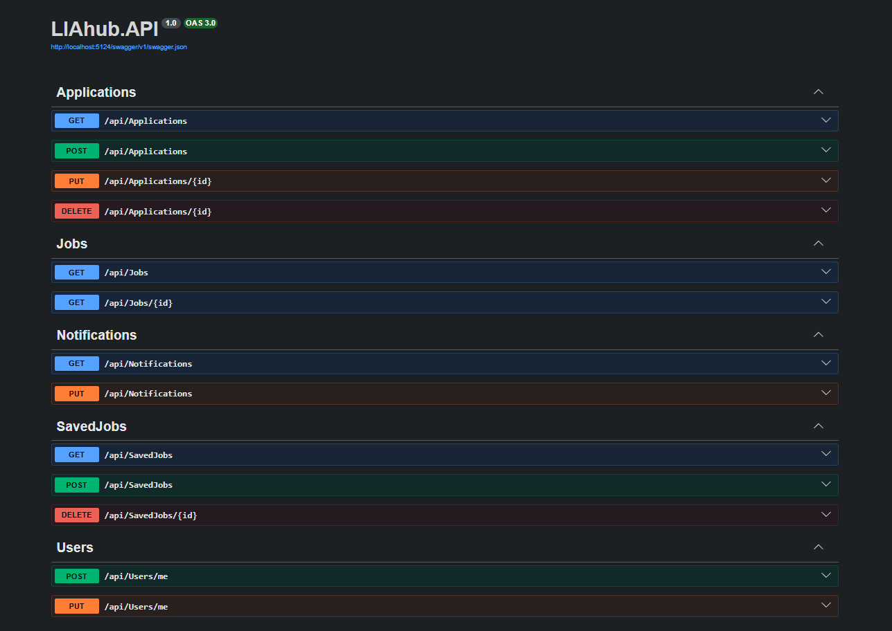

# LIAHub Backend


**LIAHub Backend** is the REST API powering [LIAHub](https://liahub.meghdadjafari.dev) — a job and internship search platform for tech students in Sweden. It fetches listings from Arbetsförmedlingen's JobTech API, analyzes them for tech stack relevance, caches them in PostgreSQL, and serves them to the frontend with skill-based match scoring.

🔗 **Live API:** [liahub-backend-production.up.railway.app](https://liahub-backend-production.up.railway.app)  
🔗 **Frontend repo:** [liahub-frontend](https://github.com/Megjafari/liahub-frontend)

---

## Table of Contents

- [Overview](#overview)
- [Features](#features)
- [Tech Stack](#tech-stack)
- [System Architecture](#system-architecture)
- [Key Engineering Challenges](#key-engineering-challenges)
- [Architecture](#architecture)
- [Project Structure](#project-structure)
- [Getting Started](#getting-started)
  - [Prerequisites](#prerequisites)
  - [Installation](#installation)
  - [Configuration](#configuration)
  - [Database Migrations](#database-migrations)
  - [Run Locally](#run-locally)
- [API Reference](#api-reference)
  - [Jobs](#jobs)
  - [Applications](#applications)
  - [Saved Jobs](#saved-jobs)
  - [Users](#users)
  - [Notifications](#notifications)
- [Authentication](#authentication)
- [Job Fetching Logic](#job-fetching-logic)
- [Email Notifications](#email-notifications)
- [Deployment](#deployment)
  - [Environment Variables](#environment-variables)
  - [Docker](#docker)
- [Database Schema](#database-schema)

---

## Overview

LIAHub Backend is built with a clean layered architecture separating API, domain, and infrastructure concerns across three projects. A background service automatically syncs job listings from Arbetsförmedlingen every 6 hours, scoring and tagging each listing based on its content. The API exposes endpoints for job search, application tracking, saved jobs, user profiles, and notification preferences — all protected via Supabase JWT authentication.

---

## Features

- **Automated job fetching** — background service polls Arbetsförmedlingen's JobTech Dev API every 6 hours across 10 search queries
- **Tech tag extraction** — scans job descriptions for 40+ technologies (.NET, React, Docker, Azure, Python, etc.)
- **Student signal detection** — identifies internship and junior-friendly listings (praktik, LIA, junior, trainee, internship, etc.)
- **Negative signal filtering** — deprioritizes senior, lead, and architect-level listings
- **Relevance scoring** — calculates a weighted score per listing based on tech tags, student signals, and negative signals
- **Skill-based match scoring** — server-side comparison of user's tech stack against job tags, returning match percentage, matched skills, and missing skills
- **Job sync** — removes listings no longer active on Arbetsförmedlingen, adds newly published ones
- **Work mode detection** — extracts Remote / Hybrid / På plats from listing content
- **Google OAuth via Supabase** — JWT validation using Supabase JWKS endpoint, no custom auth logic
- **User profiles** — name, school, LIA period, city, and tech stack preferences
- **Saved jobs** — per-user bookmarked listings
- **Application tracking** — full CRUD with status, contact info, source, notes, and applied date
- **Manual applications** — track jobs found outside the platform (LinkedIn, Indeed, company websites, etc.)
- **Email notifications** — Resend integration sends alerts when new listings match a user's tech stack
- **Docker support** — containerized for consistent and portable deployment

---

## Tech Stack

| Layer | Technology |
|-------|-----------|
| Framework | ASP.NET Core Web API |
| Language | C# |
| ORM | Entity Framework Core |
| Database | PostgreSQL (Supabase) |
| Auth | Supabase JWT (JWKS validation) |
| Background jobs | `BackgroundService` / `IHostedService` |
| Email | Resend |
| External API | Arbetsförmedlingen JobTech Dev API |
| Containerization | Docker |
| Deploy | Railway |

---

## System Architecture

```
                        ┌─────────────────────┐
                        │        User         │
                        └──────────┬──────────┘
                                   │ HTTPS
                        ┌──────────▼──────────┐
                        │   React Frontend    │
                        │  liahub.meghdad...  │
                        └──────────┬──────────┘
                                   │ REST + JWT
                        ┌──────────▼──────────┐
                        │   ASP.NET Core API  │
                        │  Railway · Docker   │
                        └────┬──────────┬─────┘
                             │          │
              ┌──────────────▼──┐   ┌───▼──────────────┐
              │   PostgreSQL    │   │  Background Job   │
              │   (Supabase)    │   │  every 6 hours    │
              └─────────────────┘   └───────┬───────────┘
                                            │
                                ┌───────────▼───────────┐
                                │   Arbetsförmedlingen  │
                                │    JobTech Dev API    │
                                └───────────────────────┘
```

---

## Key Engineering Challenges

- **Multi-project solution with clean architecture** — separating domain models (Core), data access and services (Infrastructure), and HTTP layer (API) into independent projects enforces clear boundaries and makes each layer independently testable and maintainable.

- **Background job lifecycle management** — implementing `JobFetcherService` as a hosted `BackgroundService` required careful handling of scoped dependencies inside a singleton service, solved using `IServiceScopeFactory` to create short-lived scopes per execution cycle.

- **Job sync without data loss** — rather than clearing and re-inserting all listings on every cycle, the service computes a diff between fetched external IDs and cached IDs, removing only stale listings and inserting only new ones. This preserves data integrity and prevents unnecessary database churn.

- **Timezone handling with PostgreSQL** — Arbetsförmedlingen's API returns `DateTime` values without timezone info, which Npgsql rejects when writing to `timestamp with time zone` columns. Solved by explicitly specifying `DateTimeKind.Utc` using `DateTime.SpecifyKind` before persistence.

- **JWT validation without a custom auth server** — instead of building a token issuance system, the API delegates entirely to Supabase's JWKS endpoint for JWT validation. This removes a significant surface area of complexity while keeping authentication secure and standards-compliant.

- **IPv4 compatibility on Railway** — Supabase's direct database connection uses IPv6, which Railway does not support. Resolved by switching to Supabase's Session Pooler connection string, which proxies over IPv4 without requiring any code changes.

- **EF Core design-time context factory** — running migrations from the Infrastructure project (which has no `Program.cs`) required implementing `IDesignTimeDbContextFactory` to give the EF tooling a way to instantiate the `AppDbContext` without the full application host.

---

## Architecture

The solution follows a **clean layered architecture** across three separate projects:

```
┌─────────────────────────────────────────┐
│              LIAhub.API                 │
│   Controllers · Program.cs · Docker     │
│   Handles HTTP, routing, auth, CORS     │
└────────────────────┬────────────────────┘
                     │ depends on
┌────────────────────▼────────────────────┐
│           LIAhub.Infrastructure         │
│   EF Core · Migrations · Services       │
│   BackgroundJobs · AppDbContext         │
└────────────────────┬────────────────────┘
                     │ depends on
┌────────────────────▼────────────────────┐
│             LIAhub.Core                 │
│   Domain Models only                   │
│   No external dependencies              │
└─────────────────────────────────────────┘
```

- **LIAhub.Core** — pure domain models with no dependencies
- **LIAhub.Infrastructure** — data access, EF Core, background jobs, and external services
- **LIAhub.API** — HTTP layer, controllers, middleware, and app configuration

---

## Project Structure

```
LIAhub.sln
├── LIAhub.API/
│   ├── Controllers/
│   │   ├── ApplicationsController.cs    # Application CRUD endpoints
│   │   ├── JobsController.cs            # Job listing and skill matching endpoints
│   │   ├── NotificationsController.cs   # Notification settings endpoints
│   │   ├── SavedJobsController.cs       # Save/unsave job endpoints
│   │   └── UsersController.cs          # User profile endpoints
│   ├── Properties/
│   │   └── launchSettings.json
│   ├── appsettings.json                 # App configuration (no secrets)
│   ├── Dockerfile                       # Container configuration
│   └── Program.cs                       # App setup, CORS, auth, DI registration
│
├── LIAhub.Core/
│   └── Models/
│       ├── Application.cs               # Job application with status tracking
│       ├── CachedJob.cs                 # Cached job listing from AF API
│       ├── NotificationSetting.cs       # Per-user email notification preferences
│       ├── SavedJob.cs                  # User-saved job listing
│       ├── User.cs                      # User profile
│       └── UserTechStack.cs            # Individual tech stack entry per user
│
└── LIAhub.Infrastructure/
    ├── BackgroundJobs/
    │   └── JobFetcherService.cs         # Runs every 6h, syncs jobs from AF API
    ├── Data/
    │   ├── AppDbContext.cs              # EF Core DbContext with Fluent API config
    │   └── Migrations/                  # Auto-generated EF Core migrations
    └── Services/
        ├── JobSearchService.cs          # Fetches, filters, and scores jobs from JobTech API
        └── NotificationService.cs       # Sends email notifications via Resend
```

---

## Getting Started

### Prerequisites

- [.NET SDK](https://dotnet.microsoft.com/download) (version 10 or later)
- PostgreSQL database — a free [Supabase](https://supabase.com) project works perfectly
- A Supabase project with **Google OAuth** enabled under Authentication → Providers
- [Resend](https://resend.com) account for email notifications (optional)

### Installation

```bash
git clone https://github.com/Megjafari/liahub-backend
cd liahub-backend
dotnet restore
```

### Configuration

Create `appsettings.Development.json` inside `LIAhub.API/` (this file is gitignored):

```json
{
  "ConnectionStrings": {
    "DefaultConnection": "Host=...;Database=postgres;Username=...;Password=...;Port=5432;SSL Mode=Require;Trust Server Certificate=true"
  },
  "Supabase": {
    "Url": "https://your-project-id.supabase.co"
  },
  "Resend": {
    "ApiKey": "re_your_api_key"
  }
}
```

> **Tip:** Use Supabase's **Session Pooler** connection string for compatibility with cloud platforms like Railway (IPv4 support).

### Database Migrations

Run from the `LIAhub.Infrastructure` directory:

```bash
cd LIAhub.Infrastructure
dotnet ef database update --startup-project ../LIAhub.API
```

### Run Locally

```bash
cd LIAhub.API
dotnet run
```

The API will be available at `http://localhost:5000`. Swagger UI is available at `http://localhost:5000/swagger` in development mode.

---

## API Reference

All protected endpoints require a valid Supabase JWT in the `Authorization` header.



### Jobs

| Method | Endpoint | Auth | Description |
|--------|----------|------|-------------|
| `GET` | `/api/jobs` | ❌ | Get all cached job listings |

**Query parameters:**

| Parameter | Type | Description |
|-----------|------|-------------|
| `search` | string | Filter by job title or employer name |
| `city` | string | Filter by city |
| `tech` | string | Comma-separated list of tech tags to filter by |
| `skills` | string | Comma-separated user skills — enables match scoring |

**Example:**
```
GET /api/jobs?skills=React,TypeScript,C%23&city=Stockholm
```

**Response includes per job:**
- `matchScore` — 0.0–1.0 based on skill overlap
- `matchedSkills` — skills the user has that match the listing
- `missingSkills` — skills in the listing the user does not have
- `techTags` — all detected technologies in the listing
- `studentSignals` — detected internship/junior signals
- `publishedAt` — publication date from Arbetsförmedlingen
- `workMode` — Remote / Hybrid / På plats

---

### Applications

| Method | Endpoint | Auth | Description |
|--------|----------|------|-------------|
| `GET` | `/api/applications` | ✅ | Get all applications for the current user |
| `POST` | `/api/applications` | ✅ | Create a new application |
| `PUT` | `/api/applications/{id}` | ✅ | Update status, contact info, or notes |
| `DELETE` | `/api/applications/{id}` | ✅ | Delete an application |

**POST body:**

```json
{
  "externalJobId": "string",
  "jobTitle": "string",
  "employer": "string",
  "location": "string",
  "source": "LinkedIn | Arbetsförmedlingen | Indeed | Företagets webbsida | Annat",
  "link": "string",
  "notes": "string",
  "isManual": false,
  "contactName": "string",
  "contactEmail": "string",
  "appliedAt": "2026-03-15T00:00:00Z"
}
```

**Status values:** `Sökt` · `Intervju` · `Erbjudande` · `Avslag`

---

### Saved Jobs

| Method | Endpoint | Auth | Description |
|--------|----------|------|-------------|
| `GET` | `/api/savedjobs` | ✅ | Get saved jobs for the current user |
| `POST` | `/api/savedjobs` | ✅ | Save a job listing |
| `DELETE` | `/api/savedjobs/{id}` | ✅ | Remove a saved job |

---

### Users

| Method | Endpoint | Auth | Description |
|--------|----------|------|-------------|
| `GET` | `/api/users/me` | ✅ | Get current user profile with tech stack |
| `POST` | `/api/users/me` | ✅ | Create or update user profile |

---

### Notifications

| Method | Endpoint | Auth | Description |
|--------|----------|------|-------------|
| `GET` | `/api/notifications` | ✅ | Get notification settings |
| `PUT` | `/api/notifications` | ✅ | Enable or disable email notifications |

---

## Authentication

Authentication is handled via **Supabase Google OAuth**. The API validates JWTs using Supabase's JWKS endpoint — no custom token logic is required.

All protected endpoints use `[Authorize]` and extract the user ID from the JWT `sub` claim.

```http
Authorization: Bearer <supabase_access_token>
```

Tokens are validated against:
```
https://your-project.supabase.co/auth/v1/.well-known/openid-configuration
```

---

## Job Fetching Logic

The `JobFetcherService` is a hosted background service that runs automatically every 6 hours:

1. **Fetch** — queries the JobTech Dev API using 10 keyword combinations (e.g. `systemutvecklare praktik`, `.NET junior`, `React junior`)
2. **Extract** — parses each listing for tech tags, student signals, and negative signals
3. **Score** — calculates a relevance score: `+5 per tech tag`, `+20 per student signal`, `-25 per negative signal`
4. **Filter** — discards listings below a minimum relevance threshold and removes senior/lead/architect titles
5. **Sync** — removes listings no longer active on Arbetsförmedlingen, inserts newly published ones
6. **Notify** — sends email alerts to users whose saved tech stack matches any new listing

**Tech tags detected (40+):**

`.NET` · `C#` · `ASP.NET` · `Blazor` · `React` · `Angular` · `Vue` · `TypeScript` · `JavaScript` · `Java` · `Spring` · `Python` · `Node.js` · `SQL` · `PostgreSQL` · `MongoDB` · `Docker` · `Kubernetes` · `Azure` · `AWS` · `CI/CD` · `Git` · `Linux` · and more

---

## Email Notifications

Email is sent via [Resend](https://resend.com) when new listings are found that match a user's saved tech stack. Notifications are only triggered for genuinely new listings — not on every 6-hour cycle.

To enable notifications, verify a custom sending domain in Resend and add the required DNS records (DKIM, SPF) at your domain provider.

---

## Deployment

The API is deployed on **Railway** using Docker with automatic deploys on push to `master`.

### Environment Variables

Configure the following in Railway → Variables:

| Variable | Description |
|----------|-------------|
| `ConnectionStrings__DefaultConnection` | PostgreSQL connection string (Supabase Session Pooler recommended) |
| `Supabase__Url` | Your Supabase project URL |
| `Resend__ApiKey` | Your Resend API key |

> Railway uses `__` (double underscore) as the separator for nested config keys, matching .NET's configuration system.

### Docker

The included `Dockerfile` builds and runs the API on port `8080`:

```bash
# Build
docker build -t liahub-backend .

# Run
docker run -p 8080:8080 \
  -e ConnectionStrings__DefaultConnection="Host=...;..." \
  -e Supabase__Url="https://your-project.supabase.co" \
  -e Resend__ApiKey="re_..." \
  liahub-backend
```

---

## Database Schema

| Table | Description |
|-------|-------------|
| `Users` | User profiles with name, school, LIA period, and city |
| `UserTechStacks` | Individual tech stack entries per user (one row per technology) |
| `CachedJobs` | Job listings fetched and cached from Arbetsförmedlingen |
| `SavedJobs` | User-saved job listings |
| `Applications` | Job applications with status, source, contact info, and notes |
| `NotificationSettings` | Per-user email notification preferences |

All tables use `UUID` primary keys. Foreign keys cascade on delete. `CachedJobs.TechTags` and `CachedJobs.StudentSignals` are stored as PostgreSQL `text[]` arrays.
